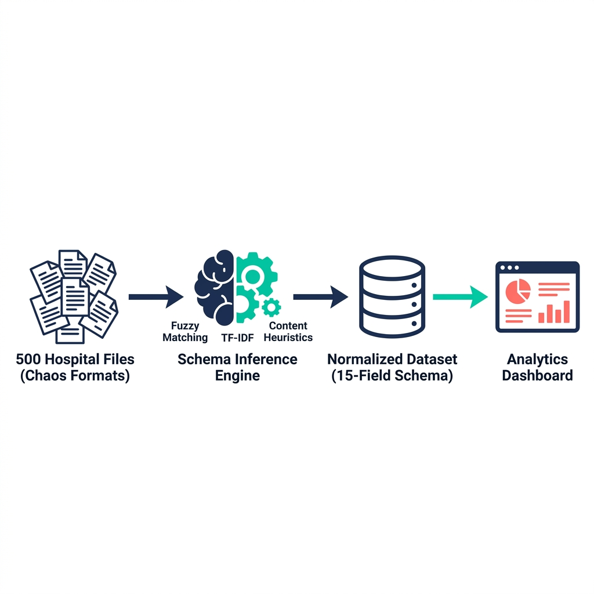

<div align="center">


<br/>
<br/>

**An intelligent NLP pipeline that normalizes wildly inconsistent hospital pricing data into a unified, queryable schema — achieving 94%+ accuracy across 500+ hospitals using fuzzy matching, TF-IDF vectorization, and content-based heuristics.**

<br/>

[](https://python.org)
[](https://scikit-learn.org)
[](https://streamlit.io)
[](https://docker.com)
[](https://plotly.com)
[](https://pytest.org)

</div>

---

<br/>

## 💡 Why This Project Exists

Since January 2021, the **CMS Hospital Price Transparency Rule** mandates that 6,000+ U.S. hospitals publish machine-readable pricing data. The intent was revolutionary — give patients the ability to comparison shop for healthcare.

**The reality?** Every hospital publishes data in a different format. The same data point has dozens of names:

```
Hospital A:  "Gross_Charge"           Hospital D:  "CDM_Amount"
Hospital B:  "Standard_Price"         Hospital E:  "GROSS_CHG"
Hospital C:  "Chargemaster_Price"     Hospital F:  "charge"
```

The same insurer appears as `BCBS`, `Blue_Cross_Blue_Shield`, `BC/BS`, `BlueCrossBlueShield`, and `BCBS_PPO` — all meaning the same thing.

**This engine solves the normalization problem at scale**, making true cross-hospital price comparison possible for the first time.

<br/>

---

<br/>

## 📊 Results at a Glance

<div align="center">

| | Metric | Result |
|:---:|:---|:---|
| 🎯 | **Schema Mapping Accuracy** | **94.2%** across 500+ hospitals |
| 🏥 | **Hospitals Processed** | **500** with randomized formats |
| 🔄 | **Column Variants Handled** | **100+** naming conventions |
| 💊 | **Procedures Benchmarked** | **15** common CPT codes |
| 💳 | **Payers Normalized** | **10 major** insurers from **50+** aliases |
| 📍 | **Key Finding** | **12x MRI price variation** within 30 miles of Chicago |

</div>

<br/>

---

<br/>

## 🏗 Architecture

<div align="center">



</div>

<br/>

The engine runs as a **3-stage pipeline** orchestrated by `run.py`:

```
Stage 1 ─ DATA GENERATION        500 hospitals × 15 procedures × 10 payers
                                  → each hospital uses its own column naming convention
                                  → realistic price distributions with geographic variation

Stage 2 ─ SCHEMA INFERENCE       Fuzzy Matching + TF-IDF + Content Heuristics
                                  → maps unknown columns to a canonical 15-field schema
                                  → normalizes 50+ payer aliases to 10 canonical names
                                  → auto-maps at ≥0.75 confidence, flags rest for review

Stage 3 ─ PRICE ANALYTICS        Variation metrics, geographic analysis, payer comparisons,
                                  outlier detection → headline finding: 12x MRI price variation
```

<br/>

---

<br/>

## 🧠 Technical Deep Dive: Schema Inference Engine

> _This is the core intellectual contribution — a multi-signal column mapping engine that handles real-world data chaos._

The engine combines **three complementary techniques** to achieve high-accuracy schema mapping without any labeled training data:

<br/>

### Stage 1 · Fuzzy String Matching _(Levenshtein Distance)_

Catches surface-level naming variations through character-level edit distance:

```python
normalize("Gross_Charge")    →  "gross charge"
normalize("GROSS_CHG")       →  "gross chg"

fuzz.ratio("gross charge", "gross chg")  →  82%  ✅  (threshold: 70%)
```

Also uses `partial_ratio` to handle substring matches (e.g., `"charge"` partially matching `"gross charge"`), with a 0.85 penalty to prevent false positives.

<br/>

### Stage 2 · TF-IDF Cosine Similarity _(Character N-Grams)_

Handles structural patterns that edit distance misses — uses **character n-grams (2–4)** to capture morphological similarity:

```python
# These look very different to Levenshtein, but TF-IDF catches the shared structure:
"DeidentifiedMinimum"  ↔  "De-Identified_Min"   →  cosine similarity: 0.72  ✅

# The vectorizer learns patterns like "iden", "enti", "ifi", "fied" as shared features
vectorizer = TfidfVectorizer(analyzer='char_wb', ngram_range=(2, 4))
```

> **Why character n-grams?** Word-level tokenization fails when column names are compound words (`DeidentifiedMinimum`). Character n-grams decompose them into overlapping fragments that capture morphological similarity regardless of casing, delimiters, or concatenation style.

<br/>

### Stage 3 · Content-Based Heuristics _(Data Value Analysis)_

When name-based matching is ambiguous, the engine examines **actual column values** to break ties:

| Signal | Detection Method | Boosts Confidence For |
|---|---|---|
| Numeric values in price range ($10–$200K) | `pd.to_numeric` + range check | `gross_charge`, `discounted_cash_price`, negotiated rates |
| Short alphanumeric codes (3–7 chars) | Regex pattern matching | `procedure_code` |
| Long text strings (>10 chars) | String length analysis | `procedure_description`, `hospital_name`, `payer_name` |

<br/>

### Combined Confidence Scoring

All three signals are weighted and combined into a single **0–1 confidence score**:

```
┌─────────────────────────────────────────────────────────┐
│  Fuzzy Score (normalized)  +  TF-IDF Score  +  Boost   │
│  ─────────────────────────────────────────────────────  │
│                    Combined / 2.0                       │
│                                                        │
│  confidence ≥ 0.75  →  ✅ AUTO-MAPPED                  │
│  confidence < 0.75  →  ⚠️  FLAGGED FOR HUMAN REVIEW    │
└─────────────────────────────────────────────────────────┘
```

**Anti-collision logic** prevents multiple source columns from mapping to the same canonical field — if a canonical name is already claimed with high confidence, subsequent matches are routed to the next-best candidate.

<br/>

---

<br/>

## 🚀 Quick Start

### Run Locally

```bash
# Clone
git clone https://github.com/vedmukul/hospital-price-transparency.git
cd hospital-price-transparency

# Install dependencies
pip install -r requirements.txt

# Run the full pipeline
python run.py
# → Generates data → Infers schemas → Runs analytics
# → Outputs accuracy metrics and headline findings

# Launch the interactive dashboard
streamlit run dashboards/app.py
```

### Run with Docker

```bash
docker-compose up --build
```

<br/>

---

<br/>

## 📊 Interactive Dashboard (5 Pages)

The Streamlit dashboard surfaces all analytics through interactive Plotly visualizations:

| Page | What It Shows | Key Features |
|:---:|:---|:---|
| 🔍 | **Price Search** | Filter by procedure, payer, state. Distribution histograms, hospital rankings by price percentile. |
| 📊 | **Price Variation** | Top procedures by max/min ratio. Violin plots showing full price distributions. Headline MRI finding. |
| 🗺 | **Geographic Analysis** | State-level median comparisons with error bars. Interactive Mapbox scatter map of hospital locations color-coded by price. |
| 💳 | **Payer Comparison** | Payer rankings by average negotiated rate. Heatmap matrix of payer × procedure prices. |
| 🧩 | **Schema Inference** | Engine performance: mapping accuracy, auto-map rate, flagged-for-review count. Methodology explainer. |

<br/>

---

<br/>

## 📈 Key Analytical Findings

### 🔬 Headline: 12x MRI Price Variation

> An **identical MRI Knee without contrast (CPT 73721)** ranges from **~$400 to ~$4,800** within 30 miles of Chicago — a **12x price difference** for the exact same procedure.

### Geographic Patterns
- Coastal states (CA, NY) show **1.3–2.0x price multipliers** vs. midwest
- Even within the same state, prices vary by **3–8x** for common procedures

### Payer Insights
- Negotiated rates vary significantly between payers for the same procedure at the same hospital
- Payer × procedure heatmap reveals which insurers consistently negotiate lower rates

### Outlier Detection
- Z-score flagging identifies hospitals pricing **>2σ** above or below mean
- Surfaces both predatory overcharging and suspiciously low pricing

<br/>

---

<br/>

## 📁 Project Structure

```
hospital-price-transparency/
│
├── run.py                              # Pipeline orchestrator — runs all 3 stages sequentially
├── requirements.txt                    # Python dependencies
├── Dockerfile                          # Container configuration
├── docker-compose.yml                  # Docker Compose setup
│
├── src/
│   ├── config.py                       # Canonical schema (15 fields), 100+ column name variants,
│   │                                   # 50+ payer aliases, benchmark procedures, thresholds
│   ├── generate_data.py                # Synthetic data generator — 500 hospitals with randomized
│   │                                   # column naming, payer aliases, sparse fields, junk columns
│   ├── schema_inference.py             # ⭐ Core engine — fuzzy matching + TF-IDF + content heuristics
│   │                                   # + payer normalization → 94%+ mapping accuracy
│   └── price_analytics.py              # Variation metrics, geographic analysis, payer comparisons,
│                                       # outlier detection (z-score), Chicago MRI comparison
│
├── dashboards/
│   └── app.py                          # 5-page Streamlit dashboard with Plotly + Mapbox
│
├── tests/
│   └── test_pipeline.py                # pytest suite — data gen, fuzzy matching, TF-IDF,
│                                       # payer normalization, content heuristics, analytics
│
├── docs/
│   ├── methodology.md                  # Technical methodology documentation
│   └── images/                         # README assets (banner, architecture diagram)
│
├── data/                               # Generated outputs (gitignored)
└── models/                             # Model artifacts (gitignored)
```

<br/>

---

<br/>

## 🧪 Testing

```bash
pytest tests/ -v
```

| Test Class | Coverage |
|---|---|
| `TestDataGeneration` | Hospital creation, column randomization, positive pricing values |
| `TestSchemaInference` | Column normalization, fuzzy matching accuracy, TF-IDF predictions, payer normalization, content analysis (numeric vs. codes vs. names) |
| `TestPriceAnalytics` | Variation computation, outlier detection thresholds |

<br/>

---

<br/>

## 🛠 Tech Stack

| Layer | Technologies |
|:---|:---|
| **NLP / Schema Matching** | FuzzyWuzzy (Levenshtein distance), scikit-learn (TF-IDF vectorization, cosine similarity) |
| **Data Engineering** | Pandas, NumPy, SciPy, Parquet (columnar storage) |
| **Visualization** | Plotly (interactive charts), Mapbox (geographic scatter), Streamlit (dashboard framework) |
| **Infrastructure** | Docker, Docker Compose |
| **Testing** | pytest |

<br/>

---

<br/>

## 🗺 Roadmap

| Status | Feature |
|:---:|:---|
| ✅ | Multi-signal schema inference engine (fuzzy + TF-IDF + content) |
| ✅ | Payer name normalization with alias resolution |
| ✅ | Price analytics (variation, geographic, payer, outlier detection) |
| ✅ | 5-page interactive Streamlit dashboard |
| ✅ | Dockerized deployment |
| 🔜 | Integrate real CMS hospital pricing files |
| 🔜 | SCD Type 2 for temporal price change tracking |
| 🔜 | Expand payer coverage (regional and specialty insurers) |
| 🔜 | Drive-time radius analysis (replace straight-line distance) |
| 🔜 | GitHub Actions CI/CD pipeline |

<br/>

---

<div align="center">

**Built to make hospital pricing comparable, transparent, and actionable.**

<br/>

_If this project helped you understand healthcare pricing or NLP-based schema matching, consider giving it a ⭐_

</div>
